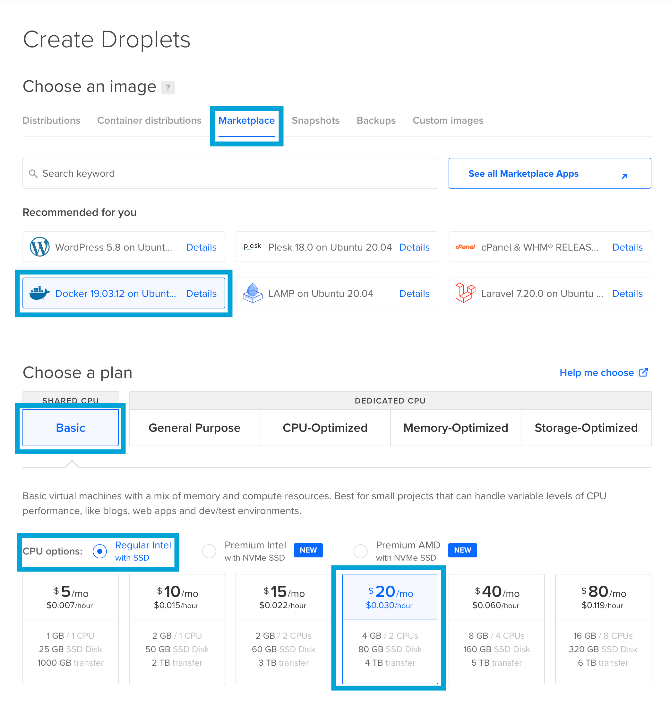
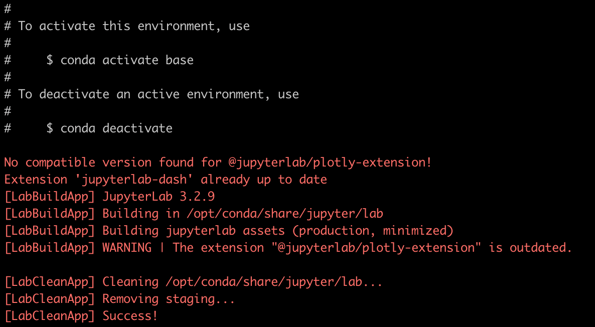
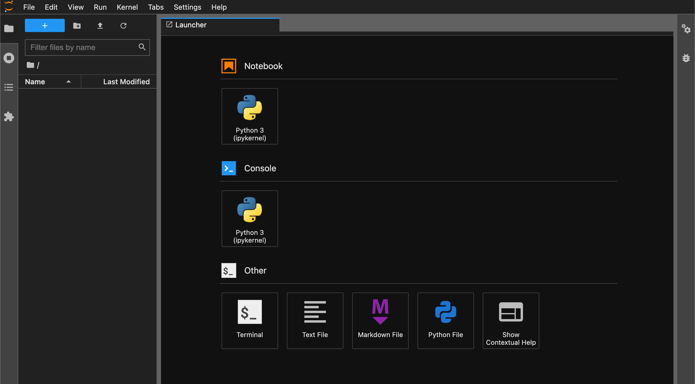
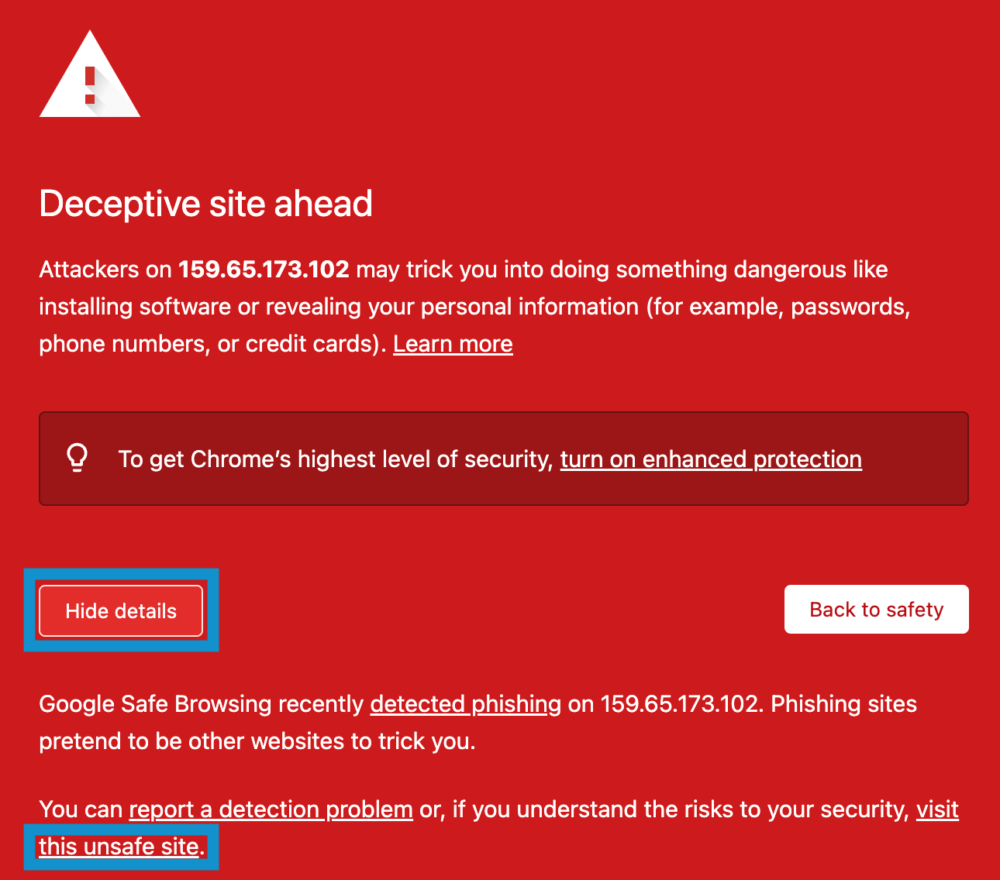

# Dockerized Trading Research Droplet

The contents herein provide everything needed to deploy a Docker image on a DigitalOcean droplet designed for backtesting trading strategies in Jupyter Lab.  

Whether it's installing a new package, testing a new strategy, switching workstations, or reproducing work in a book on algorithmic trading the success and ease of the effort often depend on the programming environment being configured just right. This container and remote deployment was built to make it fast and easy to get up running testing trading strategies without the need to be a DevOps expert.

<br>

## Technologies

This project leverages the following programs and platforms:  

* [DigitalOcean](https://www.digitalocean.com/)
* [Docker](https://docs.docker.com/)
* [Jupyter Lab](https://jupyter.org/)
* [Miniconda](https://docs.conda.io/en/latest/miniconda.html)  

The Docker image includes the basic suite of packages necessary to get started analyzing financial data and backtesting trading strategies:  

_For importing data_  

* [Alpaca](https://alpaca.markets/)
* [Quandl](https://data.nasdaq.com/) (Now known as Nasdaq Data Link)  

_For working with data_  

* [Numpy](https://numpy.org/)
* [Pandas](https://pandas.pydata.org/)  

_For visualizing data_  

* [Bokeh](https://bokeh.org/)
* [Holoviews](https://holoviews.org/)
* [Matplotlib](https://matplotlib.org/)
* [Plotly](https://plotly.com/)
* [Seaborn](https://seaborn.pydata.org/)  

_For modeling_  

* [Prophet](https://facebook.github.io/prophet/)
* [Scikit-learn](https://scikit-learn.org/stable/)  

This list is not exhaustive of the packages included in the image, and new packages will be added to `environment_conda.yml` periodically.

<br>

## Set Up

The major commands required to run the set up scripts and deploy the remote Jupyter trading lab are included in this section. Basic knowledge of ssh keys is required to follow along with the set up. DigitalOcean provides helpful instructions for adding ssh keys to their accounts, referenced [here](https://docs.digitalocean.com/products/droplets/how-to/add-ssh-keys/).  

A more verbose step-by-step with screenshots for reference is in the works and will be published in [Towards Data Science](https://towardsdatascience.com/) in the near future. Once the article is published a reference to the article will be included on this page to help those that would benefit from more granular steps.

The set up is specific to DigitalOcean, but the scripts will run on any Linux server, so AWS, Azure, and Google Cloud can all be used with only minor deviations from the instructions below.

### Build the Droplet

Those without an existing DigitalOcean account can sign up [here](https://www.digitalocean.com/). Once an account has been created and an ssh public key has been added to the account, create a Droplet that is running Linux and has Docker pre-installed. Building the Docker image requires at least 4GB of memory.  



### Create a Non-Root User

Commands run locally are prefixed with `$`, those run on the Droplet are prefixed with `#`. This convention is consistent through the set up.

__SSH into the Droplet__   

`$ ssh root@xxx.xx.xx.xxx`  

__Create the User__
    
```
# adduser <username>
# usermod -aG sudo <username>
# cd /home/<username>
```

__Add an Authorized Key__  
One the local machine create a new ssh key and paste the public key into the `authorized_keys` file.  
    
```
# mkdir .ssh
# vim .ssh/authorized_keys
```  

<br>

### Configure the Droplet and Build the Image  

This step takes several minutes and produces a great deal of content in the terminal. Prompts that require your input are in blue.  

```
# git clone https://github.com/jmischung/Dockerized-Trading-Research-Droplet.git
# cd Dockerized-Trading-Research-Droplet/
# bash config_files/setup_droplet.sh
```  

__IMPORTANT:__ When prompted to create the Jupyter password DO NOT use `\` in the password. Other symbols can be used.

During the build some red text will be output to the terminal and the program will stay there for several moments. This is expected and nothing to be concerned about.  

  

Once the build is complete, exit the root session.

<br>

### Start the Container

From the local machine ssh back into the Droplet as the non-root user that was set up earlier.  

`# ssh <username>@xxx.xx.xx.xxx`

 Create the directory where the notebooks will be stored and cd into this directory.  
    
```
# mkdir notebooks
# cd notebooks
```  

Start a Docker Container using the Docker Image that was built using the command below. You will be prompted to enter the non-root user's password as Docker requires root privileges.  
    
```
# sudo docker run -d \
 -p 8888:8888 \
 -v $(pwd):/home/ds/notebooks \
 --name jup_trading_lab \
 trading_lab
```  

Congratulations! You've successfully set up a remote Jupyter Lab will a great foundation of packages to begin analyzing financial data and testing trading strategies.

<br>

### Optional - Enable HTTPS
  
If you're using a domain name, HTTPS can quickly be enabled using certbot. This [link](https://certbot.eff.org/instructions?ws=nginx&os=ubuntufocal) takes you to the instructions specific to enabling HTTPS access on the configuration of this setup (Nginx on Ubuntu 20).  

<br>

## Usage

Enter your IP address or domain into your browser. You'll see the prompt from Jupyter to enter the password you set up earlier. Enter the password and you'll be taken to the Jupyter Lab home screen.

  

When only using the IP address to access the Jupyter Trading Lab a deceptive site warning might be generated because the site is unfamiliar to the browser, asking for a password, and is not using HTTPS. Since we know the owners of the site we don't need to be concerned. Click the details button, then the "visit this unsafe site" link and you'll be taken to the standard Jupyter password prompt.



Trade well.

<br>

## Author

Josh Mischung: [josh@knoasis.io](josh@knoasis.io), [LinkedIn](https://www.linkedin.com/in/joshmischung/)

<br>

## Contributing

I would be delighted to collaborate in an effort to improve this trading lab. If you have ideas about how to improve this image reach out to me on [LinkedIn](https://www.linkedin.com/in/joshmischung/) or email me at [josh@knoasis.io](josh@knoasis.io).

<br>

## License

MIT License

Copyright (c) [2022] [Joshua Mischung]

Permission is hereby granted, free of charge, to any person obtaining a copy
of this software and associated documentation files (the "Software"), to deal
in the Software without restriction, including without limitation the rights
to use, copy, modify, merge, publish, distribute, sublicense, and/or sell
copies of the Software, and to permit persons to whom the Software is
furnished to do so, subject to the following conditions:

The above copyright notice and this permission notice shall be included in all
copies or substantial portions of the Software.

THE SOFTWARE IS PROVIDED "AS IS", WITHOUT WARRANTY OF ANY KIND, EXPRESS OR
IMPLIED, INCLUDING BUT NOT LIMITED TO THE WARRANTIES OF MERCHANTABILITY,
FITNESS FOR A PARTICULAR PURPOSE AND NONINFRINGEMENT. IN NO EVENT SHALL THE
AUTHORS OR COPYRIGHT HOLDERS BE LIABLE FOR ANY CLAIM, DAMAGES OR OTHER
LIABILITY, WHETHER IN AN ACTION OF CONTRACT, TORT OR OTHERWISE, ARISING FROM,
OUT OF OR IN CONNECTION WITH THE SOFTWARE OR THE USE OR OTHER DEALINGS IN THE
SOFTWARE.
